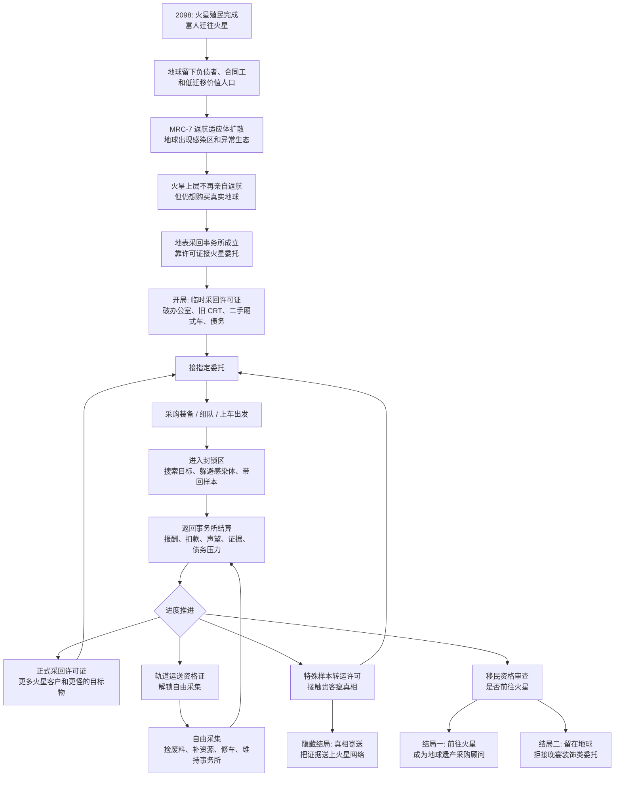

# 黑色外包（Black Commission）

黑色外包是一款 1-4 人合作外包接单游戏——一家快要倒闭的事务所靠接各种越来越离谱的外包任务维持运营。

当前 MVP 核心流程：

1. 单机开房或创建/加入联机房间。
2. 出生在破旧的事务所办公室。
3. 用办公室电脑接受任务。
4. 进入指定委托关卡（当前重点：封山雪线 / 白棘雪莲），采回目标物并躲避感染区风险。
5. 返回事务所，结算金钱/声望/经验，花钱购买装备、恢复道具、事务所升级或未来的机构收购。

完整 MVP 设计、故事背景、小队配置及第一阶段实现计划见 [docs/mvp-core-loop.md](docs/mvp-core-loop.md)。

2098 火星/地球世界观、许可证进度、代表性任务和结局设定见 [docs/world-background-2098.md](docs/world-background-2098.md)。

当前美术方向已锁定，见 [docs/art/black-commission-style-lock-v1.md](docs/art/black-commission-style-lock-v1.md)。

## 仓库与国内镜像

本项目以 GitHub 为唯一主仓库：

```bash
git clone https://github.com/DarkGameHub/BlackCommission.git
```

国内用户可以优先从 Gitee 镜像仓库 clone / pull。镜像仓库创建后，将下面地址中的账号或组织名替换为实际 Gitee 地址：

```bash
git clone https://gitee.com/<你的Gitee账号或组织名>/BlackCommission.git
```

Gitee 仓库只作为国内下载和同步镜像使用，主线开发、Issue、Pull Request、Release 以 GitHub 为准。镜像同步方向固定为：

```text
GitHub -> Gitee
```

不要在 Gitee 镜像仓库直接合并主线改动，也不要开启双向同步，以免 GitHub 和 Gitee 历史分叉。

### 国内贡献流程

如果可以访问 GitHub，请从 Gitee clone 后把 GitHub 加回主远程，在 GitHub 提交 Pull Request：

```bash
git clone https://gitee.com/<你的Gitee账号或组织名>/BlackCommission.git
cd BlackCommission
git remote rename origin gitee
git remote add origin https://github.com/DarkGameHub/BlackCommission.git
git checkout -b fix-something
```

改完后：

```bash
git add .
git commit -m "Fix something"
git push origin fix-something
```

然后到 GitHub 提 Pull Request：

```text
https://github.com/DarkGameHub/BlackCommission
```

如果贡献者访问 GitHub 很困难，可以先在 Gitee 提 Pull Request。维护者审核后，将对应提交 cherry-pick 或 patch 到 GitHub，等 GitHub 合并后再同步回 Gitee。

## 核心流程图



## 环境要求

- **Unity 版本：`6000.4.7f1`（Unity 6）。** 必须用这个版本打开——Unity 工程对版本敏感，版本不一致会强制升级或报错。建议用 [Unity Hub](https://unity.com/download) 安装对应版本。
- **依赖自动还原：** 本项目是 Unity C# 工程，没有也不需要 `requirements.txt`（那是 Python 的）。所有包依赖都锁定在 `Packages/manifest.json` 里（Netcode for GameObjects 2.11.2、URP 17.4、Input System、Relay/Authentication 等），用 Unity 打开工程时会自动下载还原，无需手动安装。
- **不要提交生成目录：** `Library/`、`Temp/`、`Logs/` 由 Unity 本地生成（已在 `.gitignore` 忽略），clone 后首次打开会自动重建，可能需要几分钟。

## Unity 工程启动

1. 若是首次 checkout，先运行 `Tools > Black Commission > Art > Setup ASV4 Art For Play`。
2. 运行 `Tools > Black Commission > MVP > Build Snow Lotus Test Scene`（生成白棘雪莲测试关，并把 HQ 默认委托接到该任务）。
3. 打开 `HQ` 场景，按 Play，点击 `创建事务所 / Start Host`，然后用办公室电脑接取白棘雪莲委托。

## 联机说明

游戏支持两种联机方式：

- **在线（Relay）：** 主菜单点「创建事务所」走 Unity Relay 在线服务，生成 6 位房间码分享给队友。需要先在 Editor 里把工程关联到一个 Unity Cloud 项目（`Edit > Project Settings > Services`）并允许匿名登录；否则会自动回退到本地模式，公网无法加入。
- **局域网直连（LAN）：** 主菜单的「LAN 直连」入口，按 IP + 端口直接开房/加入，适合本机和同网测试，不依赖在线服务。

**本地多人测试**：用「一个 Editor 实例 + 一个打包好的 Build」，或安装 ParrelSync/多 Editor 实例同时运行。最多 4 人（房主 + 3 名客户端）。

## 生成美术工作流

1. 在 Windows 且已安装 Blender 的环境下运行：
   ```
   blender --background --factory-startup --python D:/BlackCommission/docs/art/blender_outsourced_civic_commercial_v4.py
   ```
2. 在 Unity 中运行 `Tools > Black Commission > Art > Import Generated Blender Kit`。
3. 导入的 Prefab 会生成到 `Assets/_Project/Prefabs/Art`。
