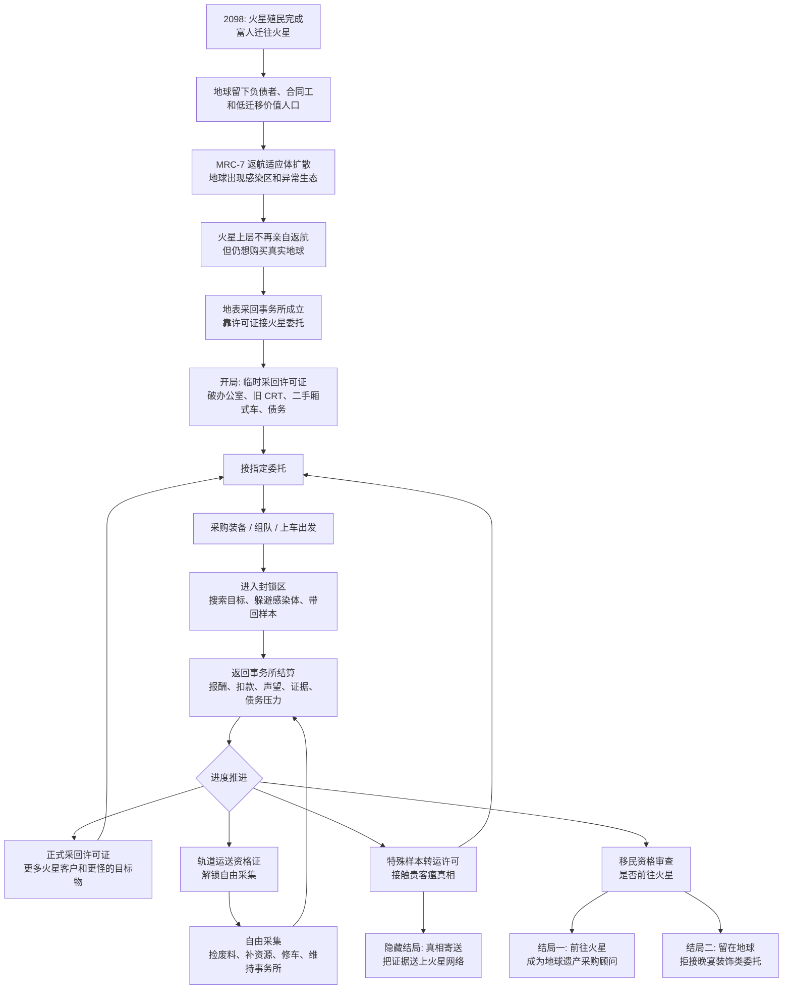

# Black Commission

Black Commission is a 1–4 player co-op commission-running game about a nearly bankrupt agency scraping by on increasingly bizarre outsourced jobs.

Current MVP core loop:

1. Start a solo session or create/join an online room.
2. Spawn in the run-down agency office.
3. Accept a job via the office computer.
4. Enter the mission site (current: **Abandoned Tower — Earth Coast 01**), retrieve the sealed bio-column, restore power if needed, and avoid the site monitor.
5. Return to the office, settle rewards (money / reputation / XP), then spend on gear, consumables, office upgrades, or future buyout pressure.

Full MVP design, story background, squad configuration, and Phase 1 implementation plan: [docs/mvp-core-loop.md](docs/mvp-core-loop.md).

2098 Mars/Earth world-building, license progression, representative commissions, and ending conditions: [docs/world-background-2098.md](docs/world-background-2098.md).

Current art direction is locked in the Art Bible: [design/art/art-bible.md](design/art/art-bible.md).

## Core Loop Diagram



## Requirements

- **Unity version: `6000.4.7f1` (Unity 6).** You must open the project with this exact version — Unity is version-sensitive and a mismatch will force an upgrade or throw errors. Install it via [Unity Hub](https://unity.com/download).
- **Git LFS:** Large assets (models, textures, audio/video) are managed with [Git LFS](https://git-lfs.com/). Install Git LFS before cloning and run `git lfs install`.
- **Automatic package restore:** This is a Unity C# project — there is no `requirements.txt` (that's Python). All package dependencies are pinned in `Packages/manifest.json` (Netcode for GameObjects 2.11.2, URP 17.4, Input System, Relay/Authentication, etc.) and are downloaded automatically when you open the project in Unity. No manual installation needed.
- **Do not commit generated directories:** `Library/`, `Temp/`, `Logs/`, `blendermodel/`, and `GeneratedAssets/` are generated locally by Unity, Blender, or AI tools (already in `.gitignore`). They are rebuilt automatically on first open after a fresh clone — this may take a few minutes.

## Cloning

Full clone with all assets:

```bash
git lfs install
git clone https://github.com/DarkGameHub/BlackCommission.git
```

If your connection is slow, clone the code first and pull LFS assets later:

```bash
GIT_LFS_SKIP_SMUDGE=1 git clone https://github.com/DarkGameHub/BlackCommission.git
cd BlackCommission
git lfs pull
git lfs checkout
```

If textures, FBX models, or scene assets are missing after opening Unity, LFS assets likely did not download completely. From the project root:

```bash
git lfs install
git lfs pull
git lfs checkout
```

Verify LFS is working correctly:

```bash
git lfs fsck
git lfs status
```

If a `.png`, `.fbx`, or `.glb` file is only a few hundred bytes and its first line reads `version https://git-lfs.github.com/spec/v1`, it is still an LFS pointer — run `git lfs pull` and `git lfs checkout` to hydrate it.

## Opening the Project

**First-time setup (run once after cloning):**

1. `Tools > Black Commission > Art > Setup ASV4 Art For Play` — imports and configures art assets.
2. `Tools > Black Commission > MVP > Tower > Rebuild v8 Whitebox (slab plan)` — procedurally generates the Tower Earth Coast 01 level geometry inside `Tower_EarthCoast_01.unity`.
3. `Tools > Black Commission > MVP > Tower > Bake Tower NavMesh` — bakes the NavMesh for AI navigation.

**Playing:**

4. Open `Assets/_Project/Scenes/HQ.unity` and press Play.
5. Click **Create Agency** (host) or **Join Agency** (client with a room code).
6. Interact with the office computer and accept the **Earth Coast 01** commission.
7. Board the van — it departs automatically to `Tower_EarthCoast_01`. Retrieve the sealed bio-column and return.

> Play starts from whichever scene is currently open. Use `Tools > Black Commission > MVP > Play Current Scene Once` to run a specific scene without switching your default.

## Multiplayer

The game supports two connection modes:

- **Online (Relay):** Click "Create Agency" in the main menu to use Unity Relay. A 6-digit room code is generated — share it with teammates. Requires the project to be linked to a Unity Cloud project in the editor (`Edit > Project Settings > Services`) with anonymous login enabled; otherwise it falls back to local mode and cannot be joined over the internet.
- **LAN Direct (LAN):** The "LAN Direct" entry in the main menu lets you host or join by IP + port. Ideal for local and same-network testing with no dependency on online services.

**Local multiplayer testing:** Use one Editor instance + one standalone Build, or install ParrelSync / run multiple Editor instances. Supports up to 4 players (host + 3 clients).

## Generated Art Workflow

1. On Windows with Blender installed, run:
   ```
   blender --background --factory-startup --python D:/BlackCommission/docs/art/blender_outsourced_civic_commercial_v4.py
   ```
2. In Unity, run `Tools > Black Commission > Art > Import Generated Blender Kit`.
3. Imported prefabs are placed in `Assets/_Project/Prefabs/Art`.
