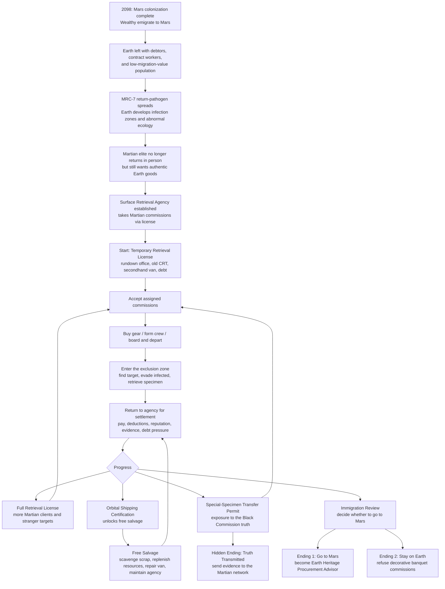

# Black Commission

Black Commission is a 1–4 player co-op commission-running game about a nearly bankrupt agency scraping by on increasingly bizarre outsourced jobs.

Current MVP core loop:

1. Start a solo session or create/join an online room.
2. Spawn in the run-down agency office.
3. Accept a job via the office computer.
4. Enter the mission site (current: **Abandoned Tower — Earth Coast 01**), retrieve the sealed bio-column, restore power if needed, and avoid the **Echo Mold** (an infected fungal host that stalks the site).
5. Return to the office, settle rewards (money / reputation / XP), then spend on gear, consumables, office upgrades, or future buyout pressure.

Full MVP design, story background, squad configuration, and Phase 1 implementation plan: [docs/mvp-core-loop.md](docs/mvp-core-loop.md).

2098 Mars/Earth world-building, license progression, representative commissions, and ending conditions: [docs/world-background-2098.md](docs/world-background-2098.md).

Current art direction is locked in the Art Bible: [design/art/art-bible.md](design/art/art-bible.md).

## Core Loop Diagram


```mermaid
flowchart TD
    A[2098: Mars colonization complete<br/>Wealthy emigrate to Mars] --> B[Earth left with debtors, contract workers,<br/>and low-migration-value population]
    B --> C[MRC-7 return-pathogen spreads<br/>Earth develops infection zones and abnormal ecology]
    C --> D[Martian elite no longer returns in person<br/>but still wants authentic Earth goods]
    D --> E[Surface Retrieval Agency established<br/>takes Martian commissions via license]

    E --> F[Start: Temporary Retrieval License<br/>rundown office, old CRT, secondhand van, debt]
    F --> G[Accept assigned commissions]
    G --> H[Buy gear / form crew / board and depart]
    H --> I[Enter the exclusion zone<br/>find target, evade infected, retrieve specimen]
    I --> J[Return to agency for settlement<br/>pay, deductions, reputation, evidence, debt pressure]

    J --> K{Progress}
    K --> L[Full Retrieval License<br/>more Martian clients and stranger targets]
    K --> M[Orbital Shipping Certification<br/>unlocks free salvage]
    K --> N[Special-Specimen Transfer Permit<br/>exposure to the Black Commission truth]
    K --> O[Immigration Review<br/>decide whether to go to Mars]

    M --> P[Free Salvage<br/>scavenge scrap, replenish resources, repair van, maintain agency]
    P --> J

    L --> G
    N --> G

    O --> Q[Ending 1: Go to Mars<br/>become Earth Heritage Procurement Advisor]
    O --> R[Ending 2: Stay on Earth<br/>refuse decorative banquet commissions]
    N --> S[Hidden Ending: Truth Transmitted<br/>send evidence to the Martian network]
```

## For New Artists — Read This First

> New to the project? This is the fast on-ramp: what the game *is*, how it plays, and the
> visual rules your work must follow. Deeper canon lives in the linked docs at the end.

### The World — Setting & Tone

The year is **2098**. Humanity has colonized Mars, but only the wealthy emigrated — Mars is a
clean, closed, expensive world. **Earth was left to the underclass**: the indebted, the contract
workers, the people the system judged as having "low migration value."

When Martian elites briefly returned to Earth, they brought back a Mars-adapted pathogen —
officially **MRC-7**, known on the street as **the Noble Guest Plague**. It infected people,
animals, plants, and fungi, turning whole regions into lockdown zones full of abnormal ecology:
infected humans, spore mists, fleshy plants, and **fungal colonies that mimic sounds**.

Mars won't come back in person — but it still wants Earth's things. Not resources (Mars
synthesizes those) but **the *real* Earth**: genuine specimens, old-ecosystem remnants, things
that can't be replicated or legally bought. So Martian clients issue **collection commissions**
to Earth through gray-market platforms.

**You run a nearly bankrupt Surface Retrieval Agency** — not heroes, a broke company. Half the
office lights are dead, the computer is a secondhand Mars-cast-off CRT, the van is second-hand,
the debt is enormous. You take jobs because the bill is due.

**Tone — "Municipal Debt Noir":** light-hearted on the surface, uncomfortable after the laugh.
The darkness is never delivered by villain speeches — it leaks out of **contracts, deductions,
and settlement notes**. The signature image: *Earth people risk death to retrieve a thing; a
Martian client uses it as a dinner-table centerpiece.*

### How It Plays — Mechanics

- **1–4 player co-op, first-person, host-authoritative** (Netcode for GameObjects).
- **The ritual loop:** broke office HQ → office computer (accept a job / buy gear) → crew boards
  the **dispatch van** → in-van transit → **mission site** → objective + a **partial-return
  choice** → van return → **HQ settlement**.
- **Progression = 5 license stages** (Temporary → Full Retrieval → Orbital Shipping →
  Special-Specimen / *Black Commissions* → Immigration Review). The only number the player sees is
  **money**. The moral slope runs through three mission tiers: **Free Salvage → Commissioned Jobs →
  Black Commissions** — the higher the pay, the darker the cost. The endgame is a **moral choice**
  (*do you still want to go to Mars?*), not a money threshold.
- **Proximity voice is a mechanic, not a convenience.** It is **open-mic by default**, and infected
  things eavesdrop and *replay your voice* to split the team — speaking is a deliberate risk.
- **Current playable mission — Abandoned Tower, Earth Coast 01:** a derelict pre-sale property
  tower. Restore power to open the upper floor, then **two-hand-carry a heavy sealed bio-column**
  (a live coastal-ecosystem display) back to the van.
- **Monsters — one sense, one counter** (LC-style). The MVP monster is the **Echo Mold**: an
  infected humanoid fungal host that hears you and replays your teammates' voices from the wrong
  direction. Contact = HP damage → **Downed**; whole team down = **mission Failure**.

### Visual Identity — Art Brief

**Identity = "Municipal Debt Noir."** The world is neglected public / civic infrastructure run by
underfunded outsourced contractors. Brand colors: **civic teal, dead-rubber black, aged paper,
sodium amber, restrained dispatch green, stamp red.**

**Fidelity = lo-fi, PS1-era low-poly** (per `style-lock-v2`): low-poly meshes, **≤256px
visible-texel textures**, ~2 m world-space tiling, **albedo-only** (no normal / AO / metalness
maps), **high roughness** (smoothness ≤ 0.3), point filtering. *(The Art Bible's older
"semi-realistic" fidelity is **superseded** — build lo-fi.)*

> **Lethal Company is a production-method reference ONLY** — strong repeatable rituals, readable
> low-cost staging, co-op extraction tension, navigable darkness. **Do not copy** LC's assets, UI,
> monsters, ship, item list, or maps. Our identity is our own.

**Surface palette (material color before light):**

| Family | Hex | Use |
|---|---|---|
| Concrete gray | `#5E5E5E` / `#707070` / `#4A4A4A` | Walls, slabs, pillars |
| Military green | `#55624A` / `#68745C` / `#475040` | Cabinets, van body, lockers, steel furniture |
| Old wood brown | `#6B5440` / `#7C624A` / `#8A7158` | Desks, crates, floorboards |
| Rust | `#7B4B2A` / `#8C5937` / `#A36842` | Pipe joints, worn metal edges, bolts |

Every surface carries **20–40% weathering** — scratches, tape, dust, chipped paint, stains are the
*primary* surface language, not a polish-pass afterthought.

**Accents & signal colors (used sparingly — each one carries meaning):**

| Signal | Hex | Means |
|---|---|---|
| Primary accent — warm tungsten amber | `#FFAB40` | Inhabited space / interactable nearby |
| CRT green — **electronic screens only** | `#6CFF5F` | A powered, processing device (*not* "safe") |
| Mission objective material | `#D4A020` | The one object in the scene with this warm gold |
| Threat presence | `#FF6A00` | Amber-orange eye pinpoints in cold light (e.g. the Echo Mold's spore eye) |
| Hazard edge | `#C8A020`–`#A87E10` | Aged warning yellow at stairs / drops / barriers |
| Civic identity dressing | teal `#3F5F5C` · paper `#D6CCAE` · stamp red `#C23A2B` | Debt notices, seals, signage — **stamp red on paper/signage only** |

**Lighting grammar (silhouette-driven darkness):** three light families only — **warm tungsten
3000K** = human habitation (the HQ); **cold industrial 5000K** = mission sites (failing,
flickering, some dead); **CRT green** = powered devices. Players navigate dark spaces by
**flashlight + light anchors**, and the **exit path is always lit**. No colored point lights, no
neon, no chrome, no clean plastic.

**Authoritative art docs:** `design/art/art-bible.md` (fidelity amended by
`docs/art/black-commission-style-lock-v2.md`) · world canon in `docs/world-background-2098.md` ·
entity stats in `design/registry/entities.yaml`.

## Requirements

- **Unity version: `6000.4.7f1` (Unity 6).** You must open the project with this exact version — Unity is version-sensitive and a mismatch will force an upgrade or throw errors. Install it via [Unity Hub](https://unity.com/download).
- **Git LFS:** Large assets (models, textures, audio/video) are managed with [Git LFS](https://git-lfs.com/). Install Git LFS before cloning and run `git lfs install`.
- **Automatic package restore:** This is a Unity C# project — there is no `requirements.txt` (that's Python). All package dependencies are pinned in `Packages/manifest.json` (Netcode for GameObjects 2.11.2, URP 17.4, Input System, Relay/Authentication, etc.) and are downloaded automatically when you open the project in Unity. No manual installation needed.
- **Do not commit generated directories:** `Library/`, `Temp/`, `Logs/`, `blendermodel/`, and `GeneratedAssets/` are generated locally by Unity, Blender, or AI tools (already in `.gitignore`). They are rebuilt automatically on first open after a fresh clone — this may take a few minutes.

## Cloning

Full clone with all assets:

```bash
git lfs install
git clone https://github.com/DarkGameHub/BlackCommission.git
```

If your connection is slow, clone the code first and pull LFS assets later:

```bash
GIT_LFS_SKIP_SMUDGE=1 git clone https://github.com/DarkGameHub/BlackCommission.git
cd BlackCommission
git lfs pull
git lfs checkout
```

If textures, FBX models, or scene assets are missing after opening Unity, LFS assets likely did not download completely. From the project root:

```bash
git lfs install
git lfs pull
git lfs checkout
```

Verify LFS is working correctly:

```bash
git lfs fsck
git lfs status
```

If a `.png`, `.fbx`, or `.glb` file is only a few hundred bytes and its first line reads `version https://git-lfs.github.com/spec/v1`, it is still an LFS pointer — run `git lfs pull` and `git lfs checkout` to hydrate it.

## Opening the Project

**First-time setup (run once after cloning):**

1. `Tools > Black Commission > Art > Setup ASV4 Art For Play` — imports and configures art assets.
2. `Tools > Black Commission > MVP > Tower > Rebuild v8 Whitebox (slab plan)` — procedurally generates the Tower Earth Coast 01 level geometry inside `Tower_EarthCoast_01.unity`.
3. `Tools > Black Commission > MVP > Tower > Bake Tower NavMesh` — bakes the NavMesh for AI navigation.

**Playing:**

4. Open `Assets/_Project/Scenes/HQ.unity` and press Play.
5. Click **Create Agency** (host) or **Join Agency** (client with a room code).
6. Interact with the office computer and accept the **Earth Coast 01** commission.
7. Board the van — it departs automatically to `Tower_EarthCoast_01`. Retrieve the sealed bio-column and return.

> Play starts from whichever scene is currently open. Use `Tools > Black Commission > MVP > Play Current Scene Once` to run a specific scene without switching your default.

## Multiplayer

The game supports two connection modes:

- **Online (Relay):** Click "Create Agency" in the main menu to use Unity Relay. A 6-digit room code is generated — share it with teammates. Requires the project to be linked to a Unity Cloud project in the editor (`Edit > Project Settings > Services`) with anonymous login enabled; otherwise it falls back to local mode and cannot be joined over the internet.
- **LAN Direct (LAN):** The "LAN Direct" entry in the main menu lets you host or join by IP + port. Ideal for local and same-network testing with no dependency on online services.

**Local multiplayer testing:** Use one Editor instance + one standalone Build, or install ParrelSync / run multiple Editor instances. Supports up to 4 players (host + 3 clients).

## Generated Art Workflow

1. On Windows with Blender installed, run:
   ```
   blender --background --factory-startup --python D:/BlackCommission/docs/art/blender_outsourced_civic_commercial_v4.py
   ```
2. In Unity, run `Tools > Black Commission > Art > Import Generated Blender Kit`.
3. Imported prefabs are placed in `Assets/_Project/Prefabs/Art`.
