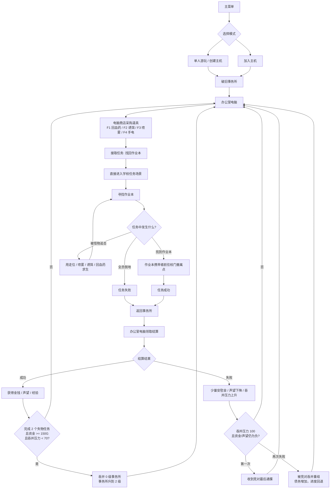

# AccidentSquad MVP Core Loop

## Status

Code-level MVP slice is implemented. The Unity editor must run `Tools > Accident Squad > MVP > Setup School MVP` once to generate and wire the playable school scene, task asset, office computer, HUD, and Build Settings.

## Core Premise

Players run a nearly bankrupt "accident handling" office in a city where every uncomfortable problem has been outsourced. Parents, schools, companies, landlords, and executives all post jobs they do not want to handle themselves.

The office starts at level 1: broken furniture, debt notices, a second-hand computer, and almost no clients. The first available category is simple lost-item recovery. The demo job is from a parent who wants the team to recover a child's homework notebook from a school after hours.

The joke is that even a tiny job can become absurdly dangerous. The long-term satire is that the company can grow by staying reputable and taking slower, cleaner work, or by chasing money and reputation collapse until only darker clients remain.

## Visual Direction

The MVP style is "outsourced civic horror": a cheap debt-soaked office connected to cold public-service spaces. Both the office and school should use the same language:

- Green terminal glow for anything controlled by the company computer.
- Red takeover / overdue-warning signage for pressure, danger, and hostile acquisition.
- Cheap gray-green institutional surfaces, second-hand furniture, paper notices, exposed utility lighting, and cluttered shelves.
- Equipment should look like improvised office purchases, not fantasy loot: pharmacy box, cheap flashlight, aerosol spray, noisy decoy.
- Monsters read as bureaucratic threats made physical. The first school monster is a homework debt collector: red coat, ledger, long arms, glowing warning eyes.

Avoid clean sci-fi, cozy office decor, or generic school grayboxes. The world should feel like a city has outsourced responsibility until the paperwork started hunting people.

## MVP Player Flow



The MVP has no vehicle step: the office computer loads the selected mission directly, and the school exit returns the team directly to the office.

```text
Main Menu
  -> Solo Host / Create Host / Join Host
  -> Rundown Office
  -> Office Computer
  -> Buy Gear From Computer
  -> Accept "Missing Homework Notebook"
  -> School Mission
  -> Find Homework Notebook
  -> Avoid Monster
  -> Exit
  -> Return to Office
  -> Claim Pending Rewards From Office Computer
  -> Buy Gear / Handle Acquisition Hooks
```

## Office Computer UX

The office computer is the MVP hub. It should behave like a compact diegetic terminal rather than a full management screen: one interaction point, clear keyboard commands, no nested economy menus, and no mouse-only flow. In the office, pressing `E` on the computer performs the highest-priority action in this order: claim pending reward, accept the available lost-item job, or accept the tutorial acquisition when it is unlocked and affordable. Gear purchasing is available only while near the computer and only when no pending reward is waiting: `F1` medkit, `F2` decoy, `F3` stun spray, `F4` flashlight.

The computer panel must always show funds/debt, reputation, office level/XP, hostile takeover pressure, current lost-item progress, the next available computer action, and shop commands. Purchased gear must immediately appear in the five-slot hotbar with an icon and quantity; unpurchased gear must not appear. The mission item never occupies a hotbar slot.

Acceptance criteria: after returning from a mission, the computer clearly blocks shopping until the pending settlement is claimed; pressing `E` applies reward or failure results exactly once; insufficient funds produces readable feedback and does not change the hotbar; after two successful lost-item jobs the acquisition prompt appears only when pressure is below `70`, costs `150G`, and raises the office to level 2.

## HQ And Map Design Framework

HQ is a dense physical menu, not an exploration map. It should stay small and immediately readable.

| HQ Zone | Purpose |
|---|---|
| Entry / rally area | Player spawn, join flow, team gathering, "broke company clocking in" tone |
| Office computer | Task start, reward claim, gear shop, acquisition prompt, company state |
| Equipment shelf | Physical reminder that gear is bought before jobs and appears in the hotbar |
| Company status wall | Debt, reputation, hostile takeover pressure, locked categories, acquisition hints |
| Upgrade display area | Small visible progression hooks: repaired furniture, new shelf space, better lighting |

School and future maps should use three reusable spatial rules:

1. Main spine plus side loops: players understand the route quickly, but have chase choices.
2. Risk gradient rooms: low-risk rooms teach layout, medium-risk rooms hold clues/consumables, high-risk rooms hold the real objective.
3. Objective and exit separation: finding the item starts the second pressure phase rather than ending the job.

Future map archetypes should be defined by one spatial gimmick before content production:

| Map | Spatial Gimmick |
|---|---|
| Abandoned school | Corridor loops, classrooms, lockers, objective-to-exit retreat |
| Underground mall | Shutters and flooded service routes change paths |
| Old apartment block | Vertical stairs/elevator risk and floor-by-floor searching |
| Night office floor | Cubicle maze, access cards, temporary power cuts |
| Hospital back-of-house | Curtains, carts, beds, light/noise management |
| Logistics warehouse | Long shelf aisles, roll-up doors, large carried objectives |

## First Mission

| Field | Value |
|---|---|
| Category | Lost Item Recovery |
| Job | Missing Homework Notebook |
| Client | Worried Parent |
| Location | School |
| Objective | Find the notebook and return to the exit |
| Threat | One school anomaly that patrols and chases players within range |
| Reward | Money, reputation, experience |
| Player count | 1-4 |

The mission item does not occupy a hotbar slot. The hotbar is reserved for equipment and consumables.

Notebook pickup and exit completion are server-validated. The server checks the acting player, distance, alive/downed state, and notebook carrier identity so a client cannot remotely pick up the objective or let a non-carrier finish the job.

## Progression Model

| System | MVP Rule |
|---|---|
| Money | Used for equipment, recovery items, office decoration, debt, and acquisitions |
| Reputation | Ranges from -100 to 100; changes which clients and job categories appear |
| Office Level | Ranges from 1 to 8; represents company scale, not combat power |
| Experience | Earned from successful jobs; failed jobs do not level the company |
| Acquisition | Tutorial acquisition becomes available after two successful lost-item jobs; hostile acquisition pressure rises after failed jobs |

For MVP, acquisition is a tutorial action rather than a full company market. The office starts at `-300G` funds / `300G` debt, and each successful homework job pays `300G`, so two clean jobs make the first acquisition affordable without removing the pressure of debt. After two successful lost-item jobs, the office computer offers a one-time level 0 office acquisition. The level 0 office is valued at `100G`; acquiring it costs `150G` and requires hostile takeover pressure below `70`. Accepting it raises the office to level 2 and marks the second job category as unlocked future content.

Failure pressure is the counterweight. If all players are downed, the mission fails and the team returns to the office. Failed jobs add hostile takeover pressure, especially when funds and reputation are below zero. At `100/100` pressure, if the office is still broke and disliked, the first trigger issues a final warning. The next failed job under the same bad conditions lets a competitor forcibly acquire/restructure the office: debt increases, office level drops by one, experience and lost-item progress reset, and the player keeps operating under worse terms rather than hitting a hard game-over screen.

## Planned Job Categories

1. Lost Item Recovery
2. Scene Cleanup
3. Personnel Rescue
4. Anomaly Handling
5. Debt and Dispute Mediation
6. Corporate Crisis Management
7. Security and Escort
8. Black Commissions

Only Lost Item Recovery is playable in the first MVP. Other categories appear as locked office-computer entries.

## Agent Team Setup

The current virtual team is:

| Agent | Role | Responsibility |
|---|---|---|
| Zeno | Creative / Game Design Director | Story, core loop, progression, category logic, mechanic sanity checks |
| Laplace | Steam / Multiplayer Technical Agent | Host/join flow, mission scene sync, network state, Steam/Relay path |
| Hilbert | UI/UX Agent | Office computer, task selection, hotbar, settlement, shop, acquisition UI |
| Banach | Art Direction Agent | Rundown office, school scene, monster, notebook, visual readability |
| Sagan | QA Agent | Multiplayer smoke tests, mission completion/failure, rewards, hotbar, acquisition validation |

PM owner: Yan Dai.

Reusable agent prompts live in [docs/skills/accidentsquad-agent-team/SKILL.md](skills/accidentsquad-agent-team/SKILL.md).

## First Implementation Slice

The first code slice should avoid heavy scene-YAML edits and establish reusable gameplay scripts:

1. Task definition data for office jobs.
2. Office computer entry point that starts the selected mission.
3. School lost-item mission manager.
4. Notebook pickup objective.
5. School exit point.
6. Basic server-authoritative school monster.
7. Five-slot player hotbar.
8. Reward application through the existing company state.

Current script slice:

| Script | Purpose |
|---|---|
| `Assets/_Project/Scripts/Office/OfficeTaskDefinition.cs` | ScriptableObject definition for office jobs |
| `Assets/_Project/Scripts/Office/OfficeComputer.cs` | Interactable office computer that starts the selected mission |
| `Assets/_Project/Scripts/Office/MvpMissionRuntime.cs` | Runtime handoff from office scene to mission scene |
| `Assets/_Project/Scripts/Office/MvpPendingReward.cs` | One-shot pending reward handoff for office-computer claiming |
| `Assets/_Project/Scripts/MVP/LostItemMissionManager.cs` | School lost-item mission state, reward grant, return-to-office flow |
| `Assets/_Project/Scripts/MVP/LostHomeworkItem.cs` | Interactable homework notebook objective |
| `Assets/_Project/Scripts/MVP/SchoolExitPoint.cs` | Mission exit / return-to-office point |
| `Assets/_Project/Scripts/MVP/SchoolMonsterAI.cs` | Server-authoritative school monster chase behavior |
| `Assets/_Project/Scripts/MVP/PlayerHotbar.cs` | Five-slot player equipment/consumable hotbar |
| `Assets/_Project/Scripts/MVP/PlayerFirstPersonRig.cs` | Local first-person hands and held-item models |
| `Assets/_Project/Scripts/MVP/MvpSceneStyleDirector.cs` | Runtime office/school style pass for MVP visual cohesion |
| `Assets/_Project/Scripts/MVP/MvpHud.cs` | Temporary MVP HUD for office state, mission objective, monster status, and hotbar |
| `Assets/_Project/Scripts/Network/MvpConnectionLimiter.cs` | Connection approval guard that caps MVP sessions at 4 players |
| `Assets/_Project/Editor/MvpProjectSetup.cs` | One-click Unity editor setup for the school MVP scene and office hookup |
| `Assets/_Project/Editor/MvpProjectValidator.cs` | One-click Unity editor validation for MVP assets, scenes, and network hookups |

## Unity Hookup Checklist

Run `Tools > Accident Squad > MVP > Setup School MVP` after the base project setup. The menu action performs the hookup below:

1. Creates `Assets/_Project/Settings/Tasks/MissingHomeworkNotebook.asset`.
2. Adds a new `MVP_OfficeComputer` to `HQ.unity` and assigns the task asset.
3. Adds `MvpHud` to HQ and the school scene.
4. Adds `PlayerHotbar`, `PlayerFirstPersonRig`, and `ClientNetworkTransform` to the player prefab if missing.
5. Enables Netcode connection approval and adds `MvpConnectionLimiter` to cap sessions at 4 players.
6. Generates `Assets/_Project/Scenes/School_LostItem_01.unity`.
7. Builds a simple school graybox with classroom, desks, lockers, lighting, notebook, exit marker, and monster.
8. Adds `LostItemMissionManager`, `LostHomeworkItem`, `SchoolExitPoint`, and `SchoolMonsterAI` scene objects.
9. Bakes NavMesh for the school scene when Unity's NavMesh builder is available.
10. Updates Build Settings to `HQ -> School_LostItem_01 -> Mall_B2`.

Then run `Tools > Accident Squad > MVP > Validate School MVP` before Play Mode.

MVP single-player should still use host mode. Non-network offline mode is intentionally not the target for the first playable build.

## MVP QA Gates

The first playable MVP is not accepted until these pass:

1. Solo host can start in office, accept school task, find notebook, return, and claim rewards.
2. Four players can join one host and load into the school together.
3. All players see the same notebook pickup state.
4. The monster chases host and clients consistently.
5. Returning to the office applies rewards once, not repeatedly.
6. Each player has five hotbar slots and item use does not affect other players incorrectly.
7. Purchased gear appears as hotbar icons and as first-person held-item models; unpurchased gear stays absent.
8. Host-only actions are enforced for starting missions and acquisition decisions.

## MVP Test Procedure

Run these after `Setup School MVP` and `Validate School MVP`:

1. Solo host happy path: `HQ -> Start Host -> Office Computer -> School -> Notebook -> Exit -> HQ -> Claim Reward`.
2. Solo host failure path: enter school, let the monster down the player, confirm return to HQ with failure reward/penalty and hostile takeover pressure.
3. Shop and hotbar path: in HQ, stand near the computer and buy gear with `F1-F4`; confirm only purchased gear appears in the icon hotbar and first-person hand model, then use `1-5` to select slots. Use a medkit after taking damage, use stun spray near the monster and confirm chase pauses, use a decoy and confirm the monster is distracted, then select the flashlight slot and confirm it toggles without being consumed.
4. Two-client smoke: host starts mission, second player joins before mission start, both load into school, one collects notebook, and only the notebook carrier can complete the exit interaction.
5. Reward idempotency: after returning to HQ, press `E` on the computer repeatedly and confirm the pending reward is applied only once.
6. Progression hook: complete two successful lost-item jobs, press `E` on the office computer, and confirm the level 0 acquisition costs `150G` and raises the office to level 2.
7. Build Settings check: `HQ` is first, `School_LostItem_01` is second, and `Mall_B2` remains available for the older rescue prototype.

## Scope Cuts For MVP

Do not build these in the first slice:

- Full vehicle system.
- Full eight-category content.
- Full acquisition strategy layer.
- Full decoration catalog.
- Steam achievements, Steam Cloud, public matchmaking.
- Complex backpack inventory.
- Multiple monster types.

The MVP should prove the office-to-mission-to-office loop first.

The mission exit is a simple return-to-office trigger for MVP; no car or vehicle interaction is planned in this slice.
